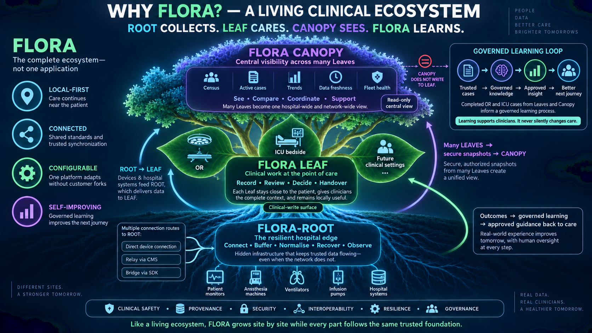
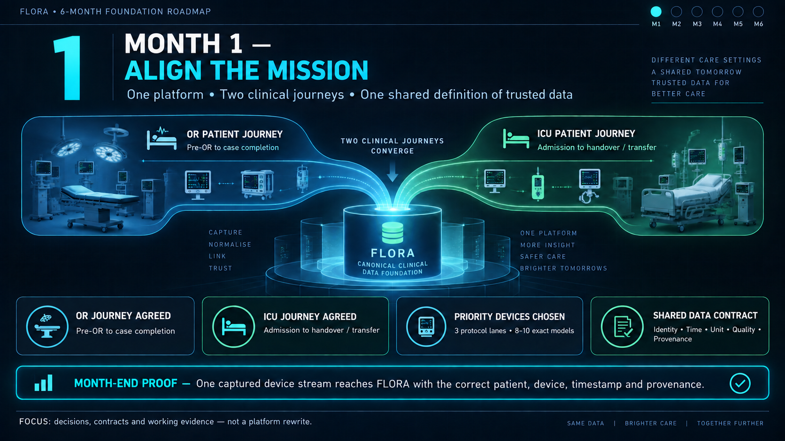
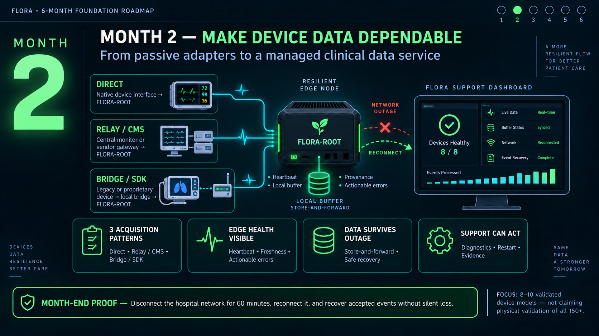
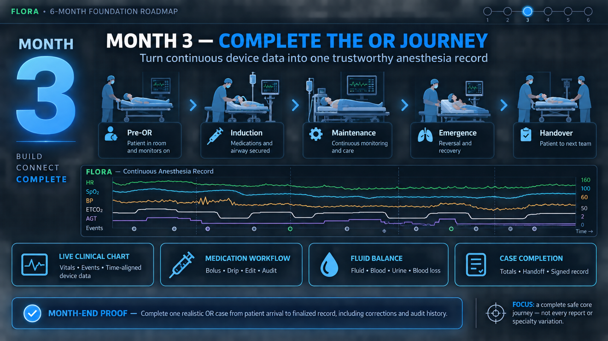
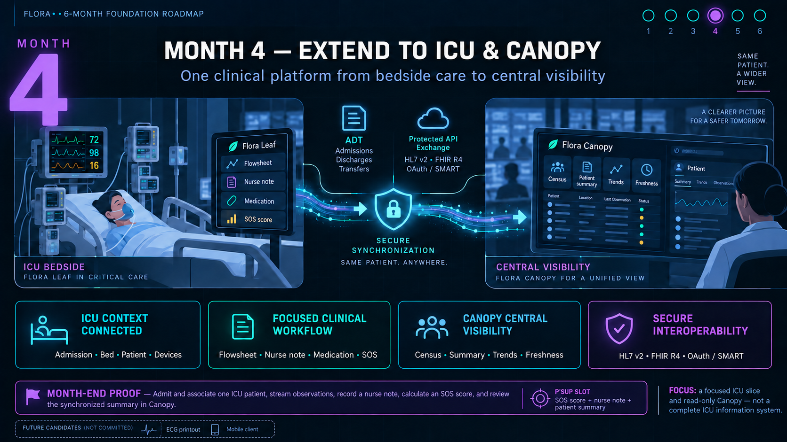
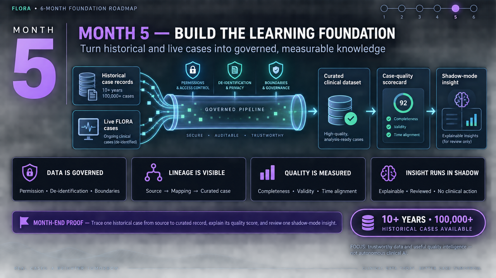
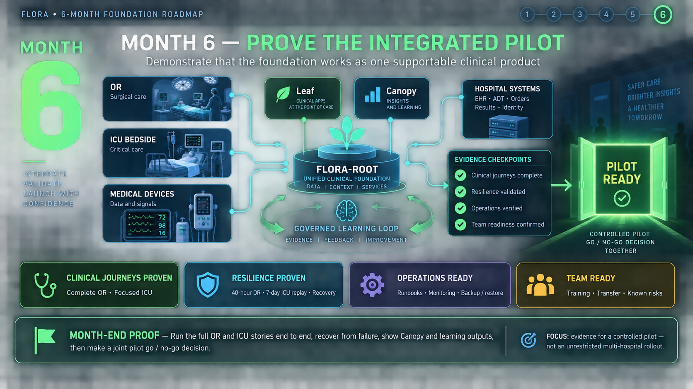
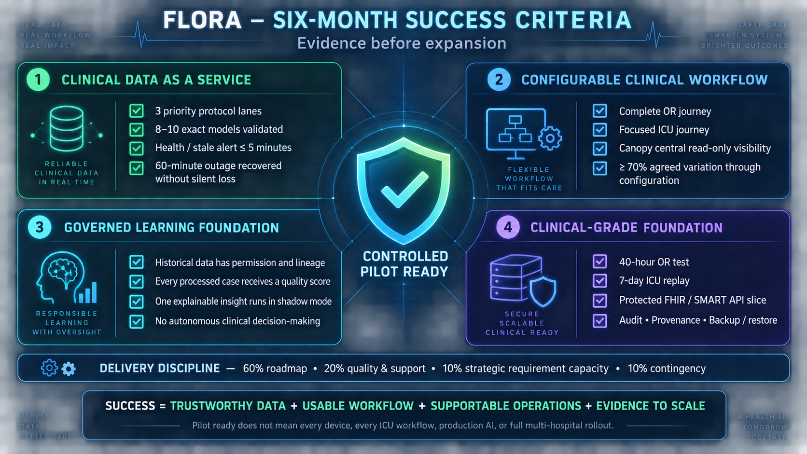

# FLORA Six-Month Foundation Roadmap — Meeting Pack

Use the seven images in this order. The monthly images communicate outcomes rather than raw sprint tasks; the final image defines the evidence required before expansion.

## Opening concept — Why FLORA?

Use this image first to establish the product language and system boundaries:

> **ROOT collects. LEAF cares. CANOPY sees. FLORA learns.**

## Month 1 — Align the mission

## Month 2 — Make device data dependable

This month incorporates the direct, relay/CMS and bridge/SDK acquisition patterns identified in P'Sup's product input. All routes converge into one FLORA-ROOT data, health, provenance and recovery contract.

## Month 3 — Complete the OR journey

## Month 4 — Extend to ICU and Canopy

P'Sup's supplied product examples are translated into a focused ICU slice: flowsheet, nurse note, medication context, configurable SOS score and patient summary. Canopy remains read-only. ECG printout and a dedicated mobile client are candidates rather than six-month commitments.

## Month 5 — Build the learning foundation

## Month 6 — Prove the integrated pilot

## Six-month success criteria

## Meeting framing

1. Begin with the patient and operational outcomes, not architecture or tickets.
2. Ask the team to challenge feasibility and dependencies within each month, not to expand the six-month scope during the first discussion.
3. Explain that P'Sup's strategic capacity is protected, but a request larger than the reserve must replace another outcome.
4. End on the success-criteria image and confirm which evidence will determine pilot readiness.
