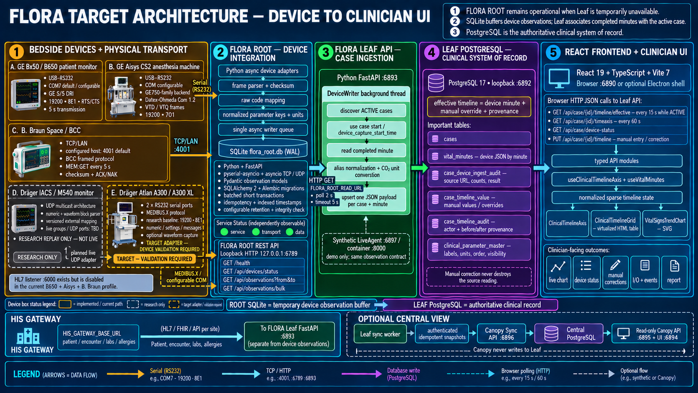
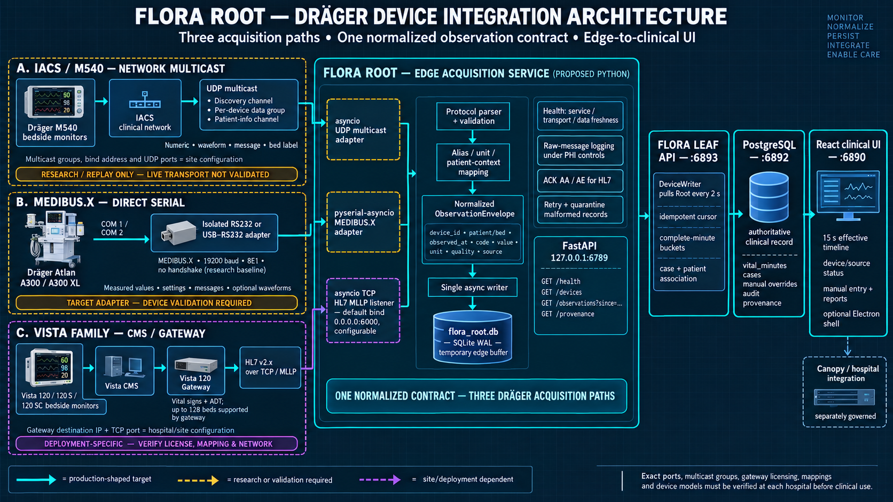
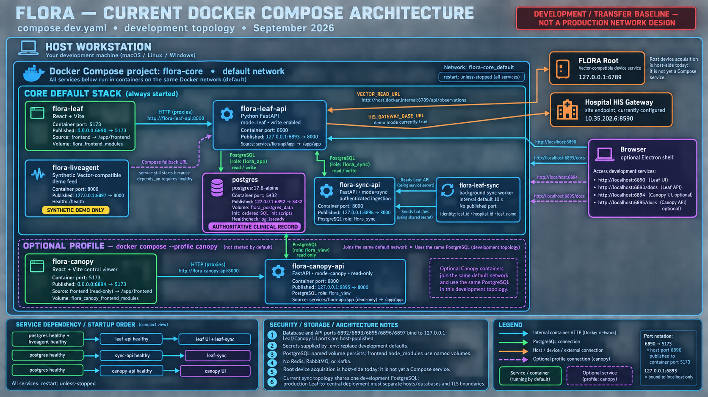
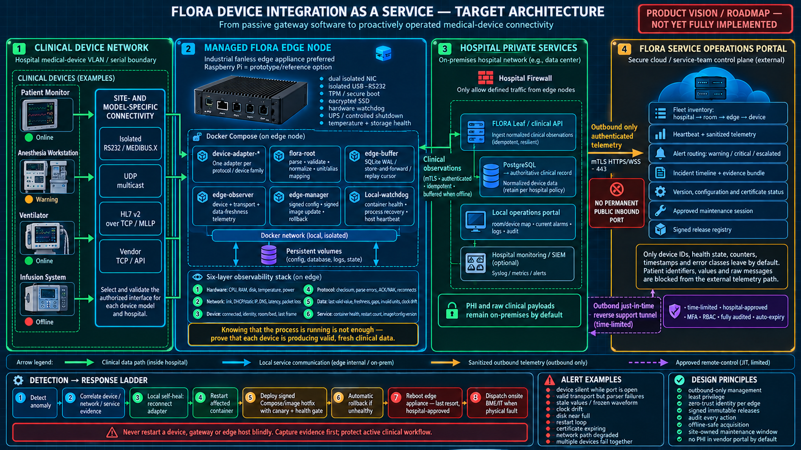
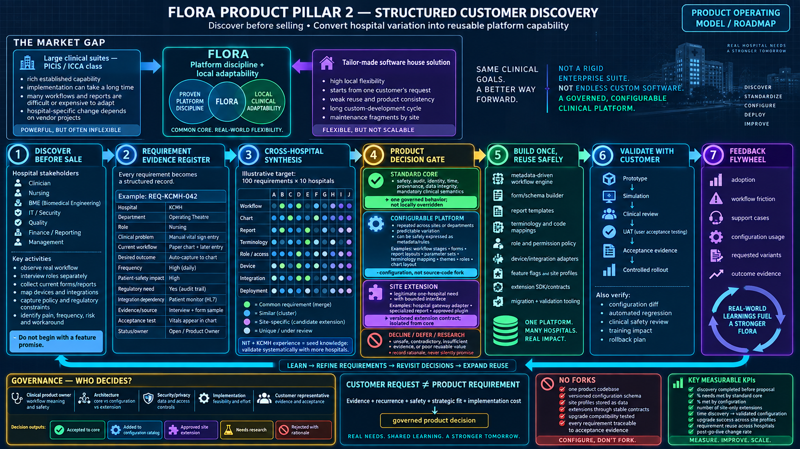
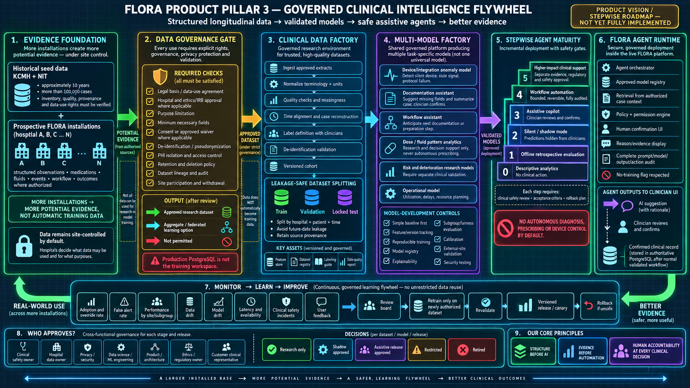

# Flora technology-transfer package

This directory is the working index for the Smart CIS (Flora) technology transfer required by the `ESM_Smart_CIS_Flora_Transfer_and_Develop_Agreement 18092569` agreement.

It is an operational handover package, not another agreement, signature form, acceptance certificate, or payment approval.

## Architecture overview



This image records the approved migration direction for the device-to-clinician path. **FLORA ROOT** replaces the former Hidro Node.js runtime with Python/FastAPI while retaining an embedded SQLite WAL observation buffer and the local port `6789` API contract. Root's database is temporary device storage; Flora Leaf PostgreSQL remains the authoritative clinical record.

Device maturity is encoded in the image: solid cards are implemented/current paths; the Dräger IACS/M540 UDP path is research replay only until live multicast configuration and clinical mapping are validated; and the Dräger Atlan A300/A300 XL MEDIBUS.X path is a target adapter that requires authorized device testing before production use.

### Dräger integration architecture



This Dräger-specific view separates the three intended acquisition paths instead of treating them as one protocol:

- IACS/M540 uses network multicast and remains research/replay only until the live transport, site multicast configuration, and clinical mappings are validated.
- MEDIBUS.X devices such as Atlan A300/A300 XL use a direct isolated RS232 or USB-to-RS232 path; the adapter remains a target implementation requiring authorized device validation.
- Vista-family bedside monitors feed Vista CMS and Vista Gateway; FLORA Root receives the gateway's HL7 v2.x MLLP output rather than connecting directly to every monitor. Gateway licensing, destination address, port, and mappings are site configuration and must be confirmed with hospital IT/BME and Dräger.

All three paths normalize into the same observation envelope before temporary edge buffering in Root. Flora Leaf PostgreSQL remains the authoritative clinical record.

### Current Docker Compose architecture



This image describes the repository's current `compose.dev.yaml` topology, not a production network design. The default stack starts PostgreSQL, Leaf API, Leaf UI, the synthetic LiveAgent, Sync API, and the Leaf sync worker. The optional `canopy` profile adds the read-only Canopy API and Canopy UI.

In the current `.env`, Leaf API reaches host-side FLORA Root through `host.docker.internal:6789`. Root is not yet a Compose service. The synthetic LiveAgent still starts because `flora-leaf-api` declares it as a healthy startup dependency, even when `VECTOR_READ_URL` points to Root. This dependency should be made profile-aware when the production Root deployment is finalized.

The current development topology also shares one PostgreSQL instance among Leaf, Sync, and optional Canopy using separate database roles. A production multi-workstation deployment must separate Leaf and central service boundaries, databases, network exposure, secrets, and TLS according to the approved deployment design.

### Device Integration as a Service target



This image is a product vision and roadmap input, not a description of functionality already delivered. It evolves the device gateway into a managed edge service with per-device health, protocol and data-freshness monitoring, offline-safe acquisition, signed updates, controlled self-healing, and a service-team fleet portal.

The production edge hardware should be selected for the hospital environment. A Raspberry Pi can serve as a prototype or reference node, while production evaluation should cover an industrial fanless appliance, isolated interfaces, encrypted durable storage, hardware watchdog, controlled power loss, thermal limits, replacement logistics, and an appropriate support lifecycle.

External service connectivity is outbound-only over authenticated encryption. No permanent inbound management port is exposed. The default external telemetry excludes patient identifiers, clinical values, and raw messages. Any remote maintenance session is time-limited, hospital-approved, MFA/RBAC protected, recorded in the audit trail, and automatically expires. Host reboot is a last-resort action after evidence capture and workflow-safety checks.

### Product pillar 2: structured customer discovery



FLORA's second product pillar formalizes customer discovery before a sales commitment or implementation promise. NIT and KCMH experience provide seed knowledge, but requirements must be captured consistently and validated across additional hospitals, departments, and user roles.

Every request enters a traceable evidence register and passes through a cross-hospital product decision gate. The governed outcomes are:

- **Standard core:** one safety-critical or semantically essential behavior shared by every deployment.
- **Configurable platform:** recurring, predictable variation represented through versioned metadata, rules, templates, mappings, roles, or site profiles rather than a source-code fork.
- **Site extension:** a legitimate hospital-specific need implemented behind a stable, versioned extension contract.
- **Decline, defer, or research:** requests that are unsafe, contradictory, weakly evidenced, or currently provide insufficient reusable value, with the rationale recorded.

The operating principle is `customer request != product requirement`. Evidence, recurrence, safety, strategic fit, implementation cost, and acceptance criteria determine the product decision. Customer validation and production learning then feed the next discovery cycle.

### Product pillar 3: governed clinical intelligence



FLORA's third product pillar uses the platform's structured longitudinal data to develop multiple task-specific models and gradually introduce safe assistive agents. The historical KCMH and NIT material is a potential seed dataset described as approximately ten years and more than 100,000 cases; its exact inventory, quality, provenance, legal basis, and permitted uses must be verified before research or model development.

Additional installations create more potential evidence, not automatic training data. Clinical data remains controlled by each participating hospital by default. Research use requires an explicit legal basis and data-use agreement, privacy and security controls, minimum-necessary extraction, de-identification or pseudonymization, lineage, retention rules, and ethics or regulatory review where applicable. The production PostgreSQL database is not the model-training workspace.

The target capability grows through controlled stages: descriptive analytics, retrospective evaluation, silent/shadow validation, clinician-confirmed assistance, bounded workflow automation, and separately approved higher-impact clinical support. FLORA does not permit autonomous diagnosis, prescribing, or device control by default. Every model and agent release requires traceable evidence, clinical safety review, acceptance criteria, monitoring, a rollback path, and human accountability.

## Transfer trigger and deadline

The parties must confirm the contractual trigger date before counting the delivery period. The agreement ties the initial transfer to signing and receipt of the payment identified in the agreement. Record the confirmed trigger below and calculate the ten working days using ESM's working-day calendar.

| Field | Value |
| --- | --- |
| Contract signed | 21 September 2026 (planned; replace with actual) |
| Contractual trigger confirmed | Pending |
| Day 1 | Pending |
| Day 10 deadline | Pending |
| ESM transfer owner | Pending |
| Flora technical owner | Nanut Lertmahakiat |
| Secure transfer location | Pending |

## What ESM receives

The handover is built from the repository itself. The detailed technical documents remain beside the code so that they can be maintained with each release.

| Area | Authoritative material |
| --- | --- |
| Product and runtime overview | [`../../README.md`](../../README.md) |
| Backend architecture and service ownership | [`../BACKEND-ARCHITECTURE.md`](../BACKEND-ARCHITECTURE.md) |
| Frontend and React component architecture | [`../FRONTEND-ARCHITECTURE.md`](../FRONTEND-ARCHITECTURE.md) |
| PostgreSQL schema and data model | [`../POSTGRESQL-STRUCTURE.md`](../POSTGRESQL-STRUCTURE.md), [`../database/flora-schema.sql`](../database/flora-schema.sql) |
| API and integration inventory | [`../BACKEND-API-INVENTORY.md`](../BACKEND-API-INVENTORY.md) |
| Device compatibility and validation register | [`../DEVICE-COMPATIBILITY-CATALOG.md`](../DEVICE-COMPATIBILITY-CATALOG.md) |
| Access control and roles | [`../ACCESS-CONTROL.md`](../ACCESS-CONTROL.md) |
| Clinical terminology | [`../CLINICAL-TERMINOLOGY.md`](../CLINICAL-TERMINOLOGY.md) |
| User workflow and training | [`../FLORA-User-Training-Flow.md`](../FLORA-User-Training-Flow.md) |
| Release history | [`../RELEASE_NOTES.md`](../RELEASE_NOTES.md) |
| Installation configuration | [`../../.env.example`](../../.env.example), [`../../compose.dev.yaml`](../../compose.dev.yaml) |
| Desktop packaging | [`../../electron/README.md`](../../electron/README.md), [`../../package.json`](../../package.json) |
| Third-party software | [`THIRD-PARTY-SOFTWARE.md`](THIRD-PARTY-SOFTWARE.md) |
| Access and secret transfer | [`ACCESS-AND-SECRETS.md`](ACCESS-AND-SECRETS.md) |
| Agreement deliverable tracking | [`DELIVERY-REGISTER.md`](DELIVERY-REGISTER.md) |

## Current system baseline

These values describe the repository observed while preparing this package. They are not the final handover baseline.

| Item | Current value |
| --- | --- |
| Repository | `https://github.com/nanutlmhk/flora-core.git` |
| Branch | `main` |
| Observed commit | `8131f6bd974521bc3cad57b143d4e73f31afcbd6` |
| Product version | `1.2.2` |
| Edition | `full` |
| Baseline state | **Not frozen: working tree contains uncommitted product work** |

Do not deliver the observed commit as the final source baseline. Before transfer, commit the intended product changes, pass validation, create a signed or annotated tag, and generate a source archive and checksum from that exact tag.

## Ten-working-day execution plan

| Day | Work | Output |
| --- | --- | --- |
| 1 | Confirm owners, deadline, secure channel, repository destination, and ESM accounts | Completed contact/access record |
| 1-2 | Clean and freeze the intended source baseline | Commit, release tag, source archive, SHA-256 |
| 2-3 | Grant repository and document access; verify ESM can clone | Access evidence without passwords |
| 3-4 | Walk through Leaf, Canopy, FastAPI, PostgreSQL, sync, device, and HIS boundaries | Architecture session notes |
| 4-5 | Run a clean build and start the development stack | Build log and health-check output |
| 5-6 | Review schema, migrations, backup, and restore | Database rehearsal record |
| 6-7 | Review API, authentication, Vector/HIS interfaces, and external dependencies | Integration inventory with owners |
| 7-8 | Review clinical workflow, medication/I/O charting, reports, and case lifecycle | Workflow notes and open questions |
| 8-9 | Transfer test/demo information through the secure channel and run validation | Test output and demo run record |
| 10 | Resolve or register remaining gaps and publish the final package index | Completed delivery register |

## Clean build and verification

Prerequisites: Git, Docker Desktop with Compose, PowerShell, and access to the repository.

```powershell
git clone https://github.com/nanutlmhk/flora-core.git
Set-Location flora-core
git checkout <handover-tag>
Copy-Item .env.example .env
```

Replace every placeholder secret in `.env` before using any non-local environment. Never commit `.env`.

```powershell
docker compose -f compose.dev.yaml up -d --build
docker compose -f compose.dev.yaml ps
Invoke-RestMethod http://localhost:6893/health
```

Open:

- Leaf UI: `http://localhost:6890`
- Leaf API documentation: `http://localhost:6893/docs`
- Synthetic demo device health: `http://localhost:6897/health`

Canopy is optional and starts through its profile:

```powershell
docker compose -f compose.dev.yaml --profile canopy up -d --build
Invoke-RestMethod http://localhost:6895/health
```

Validation commands:

```powershell
docker exec flora-core-flora-leaf-api-1 python -m compileall -q /app/app
docker exec flora-core-flora-leaf-1 npm run build
docker compose -f compose.dev.yaml logs --no-color --tail 200
```

Container names can differ when the Compose project name is overridden. Use `docker compose -f compose.dev.yaml ps` to resolve the actual names.

## Database backup and restore rehearsal

Create the backup outside the container and protect it as clinical data:

```powershell
docker compose -f compose.dev.yaml exec -T postgres pg_dump -U flora_admin -d flora -Fc > flora-handover.dump
Get-FileHash .\flora-handover.dump -Algorithm SHA256
```

Restore only into an empty rehearsal database. Do not overwrite the live clinical database.

```powershell
docker compose -f compose.dev.yaml exec -T postgres createdb -U flora_admin flora_restore_test
Get-Content .\flora-handover.dump -AsByteStream -ReadCount 0 | docker compose -f compose.dev.yaml exec -T postgres pg_restore -U flora_admin -d flora_restore_test --clean --if-exists
```

Record the backup hash, restore date, row-count checks, operator, and result in the delivery register. Remove rehearsal data according to the agreed retention policy.

## Runtime boundaries that must be explicit

- Flora Leaf is the write-capable perioperative workstation.
- PostgreSQL is the clinical system of record.
- Flora Canopy is the central read-only viewer.
- Leaf-to-Canopy synchronization uses the FastAPI contract and sync worker.
- `flora-liveagent` is a synthetic Vector-compatible demo feed, not the production device source.
- Production device use requires the real `VECTOR_READ_URL` and customer network readiness.
- HIS behavior depends on the customer gateway and must be tested in the agreed environment.
- Blood-product entry is currently manual. No Blood Bank integration should be represented as delivered unless separately implemented and agreed.

## Documents that are historical, not deployment authority

`FLORA-Architecture-Flow-Diagram-Guide.md` and `FLORA-Database-Diagram-Guide.md` still describe the older Node/Express and SQLite architecture. They must not be used as the current deployment authority. The authoritative order is:

1. repository source at the handover tag;
2. root `README.md`;
3. `BACKEND-ARCHITECTURE.md`;
4. `POSTGRESQL-STRUCTURE.md`;
5. `FRONTEND-ARCHITECTURE.md`;
6. generated FastAPI OpenAPI document from the handover build.

## Final package structure

The transfer archive should contain:

```text
flora-transfer-<tag>/
  source/                  source archive from the frozen tag
  documentation/           this index and linked technical documents
  database/                schema, ordered migrations, backup/restore record
  api/                     exported OpenAPI and integration notes
  dependencies/            lockfiles, requirements, license inventory
  validation/              build, test, health, and demo evidence
  checksums/SHA256SUMS.txt  hashes for every immutable archive/evidence file
```

Credentials, private keys, production certificates, and patient data must not be placed in this archive. Transfer them separately according to [`ACCESS-AND-SECRETS.md`](ACCESS-AND-SECRETS.md).
